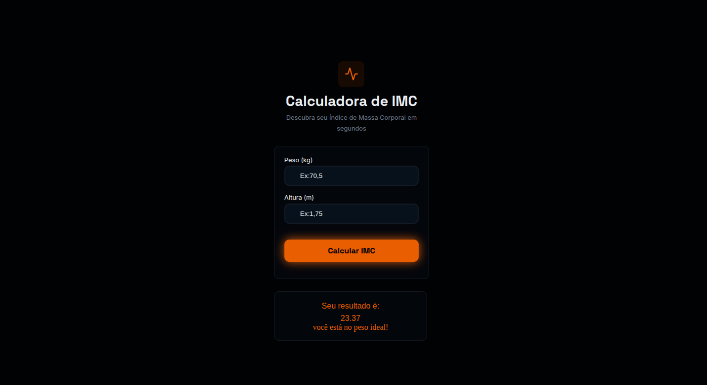

# 🧮 Calculadora de IMC

> Descubra seu Índice de Massa Corporal em segundos — projeto front-end desenvolvido com HTML5, CSS3 e JavaScript puro.

---

## 📋 Índice

- [Sobre o Projeto](#sobre-o-projeto)
- [Funcionalidades](#funcionalidades)
- [Como Usar](#como-usar)
- [Tabela de IMC](#tabela-de-imc)
- [Estrutura de Pastas](#estrutura-de-pastas)
- [Tecnologias Utilizadas](#tecnologias-utilizadas)
- [Conceitos Aplicados](#conceitos-aplicados)
- [O que aprendi](#o-que-aprendi)

---

## 📌 Sobre o Projeto

A **Calculadora de IMC** é um projeto front-end que permite ao usuário informar seu **peso (kg)** e **altura (m)** e receber instantaneamente o seu **Índice de Massa Corporal (IMC)**, junto com uma mensagem indicando a classificação do resultado.

O projeto foi desenvolvido com foco em praticar a integração entre **HTML estrutural**, **CSS estilizado com variáveis** e **lógica JavaScript com manipulação do DOM**.

---

## 🖼 Preview



## ✅ Funcionalidades

- [x] Formulário com campos de **peso** e **altura**
- [x] Cálculo automático do IMC ao submeter o formulário
- [x] Exibição dinâmica do resultado no DOM (sem recarregar a página)
- [x] Classificação do IMC em **5 categorias** com mensagens de alerta
- [x] Limpeza automática dos campos após o cálculo
- [x] Prevenção do comportamento padrão do formulário com `event.preventDefault()`
- [x] Design responsivo com CSS customizado

---

## 🚀 Como Usar

1. Clone o repositório:
   ```bash
   git clone https://github.com/seu-usuario/calculadora-imc.git
   ```

2. Abra o arquivo `index.html` diretamente no navegador — **nenhuma instalação necessária**.

3. Preencha seu **peso em kg** (ex: `70,5`) e sua **altura em metros** (ex: `1,75`).

4. Clique em **"Calcular IMC"** e veja o resultado aparecer na tela.

---

## 📊 Tabela de IMC

A lógica JavaScript classifica o IMC conforme a tabela abaixo:

| IMC              | Classificação                          | Mensagem exibida                          |
|------------------|----------------------------------------|-------------------------------------------|
| Abaixo de 17     | Muito abaixo do peso                   | Cuidado, você está muito abaixo do peso!  |
| 17 a 18,49       | Abaixo do peso                         | Você está abaixo do peso!                 |
| 18,5 a 24,99     | Peso ideal ✅                           | Você está no peso ideal!                  |
| 25 a 29,99       | Acima do peso                          | Cuidado, você está acima do peso!         |
| 30 ou mais       | Obesidade                              | Cuidado, Obesidade!                       |

> **Fórmula usada:** `IMC = peso / (altura × altura)`

---

## 📁 Estrutura de Pastas

```
calculadora-imc/
│
├── index.html
└── assets/
    ├── css/
    │   ├── style.css       # Estilos principais do projeto
    │   ├── resete.css      # Reset de estilos padrão do navegador
    │   ├── color.css       # Variáveis de cores (--color-two, --color-five, etc.)
    │   └── font.css        # Variáveis de fontes (--font-space, --font-inter)
    ├── js/
    │   └── script.js       # Lógica de cálculo e manipulação do DOM
    └── img/
        └── icon-imc.svg    # Ícone da calculadora exibido no topo
```

---

## 🛠 Tecnologias Utilizadas

| Tecnologia   | Uso no projeto                                              |
|--------------|-------------------------------------------------------------|
| **HTML5**    | Estrutura semântica da página com `<section>`, `<form>`, `<label>` |
| **CSS3**     | Estilização com Flexbox, variáveis CSS, pseudo-elementos, transições |
| **JavaScript** | Lógica de cálculo, manipulação do DOM, controle de eventos |

---

## 🧠 Conceitos Aplicados

### HTML
- Uso de `<section>` para estruturar a interface principal
- Formulário com `onsubmit` vinculado a uma função JavaScript
- `<label>` associado ao `<input>` pelo atributo `for` + `id`
- Atributos `placeholder` para guiar o usuário

### CSS
- **Variáveis CSS** (`var(--color-two)`, `var(--font-space)`) para manter consistência visual
- **Importação modular** de CSS com `@import` (separação de cores, fontes e estilos)
- **Flexbox** para alinhar e organizar os elementos verticalmente
- **`position: absolute` + `transform: translate(-50%, -50%)`** para centralizar o ícone dentro do container
- **`box-shadow`** com `rgba` para criar efeito de brilho no botão
- **`transition`** e **`:hover`** para efeito de escala no botão
- **`border-radius`**, **`padding`**, **`margin`** para espaçamento e arredondamento visual

### JavaScript
- **`event.preventDefault()`** — impede o formulário de recarregar a página ao ser submetido
- **`document.getElementById()`** — captura os valores dos inputs e o container de resultado
- **Variáveis globais** (`var`) para armazenar peso, altura, IMC e resultado
- **Cálculo matemático:** `imc = peso / (altura * altura)`
- **`if / else if`** — estrutura condicional para classificar o IMC em 5 faixas
- **`innerHTML`** — injeta dinamicamente HTML com o resultado no DOM
- **`imc.toFixed(2)`** — formata o número para 2 casas decimais
- **Limpeza dos campos:** `document.getElementById("peso").value = ''`

---

## 📚 O que aprendi

- Como organizar um projeto front-end com **separação de responsabilidades** (HTML para estrutura, CSS para estilo, JS para lógica)
- Como **modularizar o CSS** usando `@import` e variáveis de design tokens
- Como **capturar eventos de formulário** e manipular o DOM com JavaScript puro
- Como usar **template literals** (crase `` ` ``) para montar HTML dinâmico com variáveis dentro do JS
- Como aplicar **lógica condicional** para exibir mensagens diferentes baseadas em faixas de valor
- A diferença entre **`var` e escopo** — e como variáveis globais funcionam em JS

---

## 👨‍💻 Autor

Feito com 💙 por **[Seu Nome]** — estudando desenvolvimento front-end.

[](https://github.com/seu-usuario)
